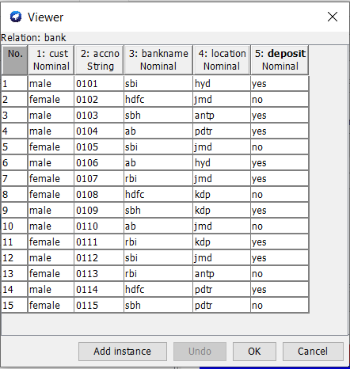
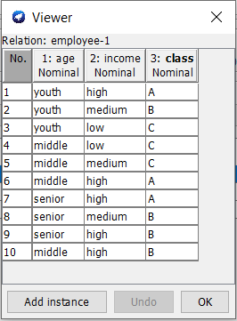
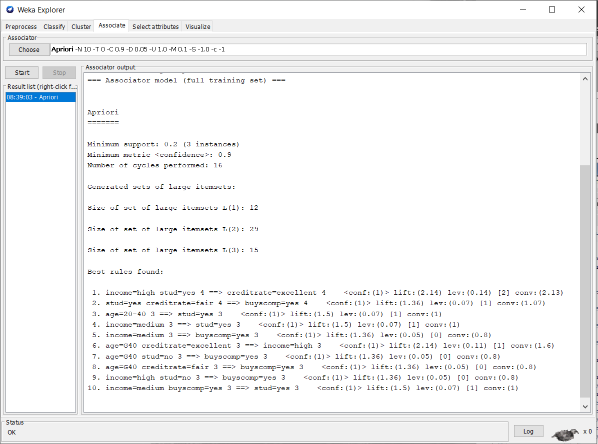

### EX2 Generating Association Rules for Employee dataset using Apriori Algorithm
### DATE: 17.02.2024
### AIM: 
To generate associate rules for the employee dataset using Apriori Algorithm.
### Description:
In data mining, association rule learning is a popular and well researched method for discovering interesting
relations between variables in large databases. It can be described as analyzing and presenting strong rules discovered
in databases using different measures of interestingness. In market basket analysis association rules are used and they
are also employed in many application areas including Web usage mining, intrusion detection and bioinformatics.
Creation of Buying Table:
### Procedure:
1) Open Start -> Programs -> Accessories -> Notepad
2) Type the following training data set with the help of Notepad for Buying Table , Banking Table & Employee Table.

```
------------
Buying Table
------------
@relation buying
@attribute age {L20,20-40,G40}
@attribute income {high,medium,low}
@attribute stud {yes,no}
@attribute creditrate {fair,excellent}
@attribute buyscomp {yes,no}

@data
L20,high,no,fair,yes
20-40,low,yes,fair,yes
G40,medium,yes,fair,yes
L20,low,no,fair,no
G40,high,no,excellent,yes
L20,low,yes,fair,yes
20-40,high,yes,excellent,no
G40,low,no,fair,yes
L20,high,yes,excellent,yes
G40,high,no,fair,yes
L20,low,yes,excellent,no
G40,high,yes,excellent,no
20-40,medium,yes,excellent,yes
L20,medium,yes,fair,yes
G40,high,yes,excellent,yes

--------------
Banking Table
--------------
@relation bank
@attribute cust {male,female} 
@attribute accno {0101,0102,0103,0104,0105,0106,0107,0108,0109, 0110,0111,0112,0113,0114,0115}
@attribute bankname {sbi,hdfc,sbh,ab,rbi} 
@attribute location {hyd,jmd,antp,pdtr,kdp} 
@attribute deposit {yes,no}

@data 
male,0101,sbi,hyd,yes 
female,0102,hdfc,jmd,no 
male,0103,sbh,antp,yes 
male,0104,ab,pdtr,yes 
female,0105,sbi,jmd,no 
male,0106,ab,hyd,yes 
female,0107,rbi,jmd,yes 
female,0108,hdfc,kdp,no 
male,0109,sbh,kdp,yes 
male,0110,ab,jmd,no 
female,0111,rbi,kdp,yes 
male,0112,sbi,jmd,yes 
female,0113,rbi,antp,no 
male,0114,hdfc,pdtr,yes 
female,0115,sbh,pdtr,no


---------------
Employee Table
---------------
@relation employee-1
@attribute age {youth, middle, senior} 
@attribute income {high, medium, low} 
@attribute class {A, B, C}

@data
youth, high, A 
youth,medium,B 
youth, low, C 
middle, low, C 
middle, medium, C 
middle, high, A 
senior, low, C 
senior, medium, B 
senior, high, B 
middle, high, B
```
3) After that the file is saved with .arff file format.
4) Minimize the arff file and then open Start -> Programs -> weka-3-4.
5) Click on weka-3-4, then Weka dialog box is displayed on the screen.
6) In that dialog box there are four modes, click on explorer.
7) Explorer shows many options. In that click on ‘open file’ and select the arff file
8) Click on edit button which shows buying table on weka.
### OUTPUT:
#### Buying Table:


#### Banking Table:


#### Employee Table:


### Procedure for Association Rules:
1) Open Start -> Programs -> Accessories -> Notepad
2) Open explorer.
3) Click on open file and select buying.arff
4) Select Associate option on the top of the Menu bar.
5) Select Choose button and then click on Apriori Algorithm.
6) Click on Start button and output will be displayed on the right side of the window.

### OUTPUT:
#### Buying Table:


#### Banking Table:


#### Employee Table:


### RESULT: 
hus, generation of association rules using apriori algorithm is executed succesfully.